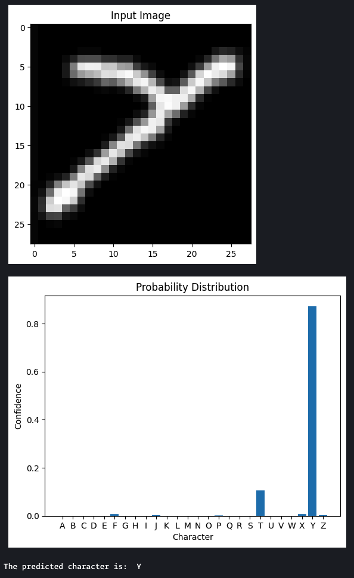

# OCRacle

Developer Names: Phillip Tran

Date of project start: January 13, 2025

This project is an optical character recognition tool for detecting Latin alphabet characters.

The folders and files for this project are as follows:

- docs - Documentation for the project
- refs - Reference material used for the project, including papers
- src - Source code
- test - Test cases
- screenshots - Screenshots of the application

## Installation

For installation instructions, reference the INSTALL.md file in the root directory of the project.

## Usage

### Training the Model

To train the model, you can use the following command:
```bash
python src/train.py
```

This will train the model and save it to `src/model.keras`:

```
Training model...
Epoch 1/5
3900/3900 ━━━━━━━━━━━━━━━━━━━━ 10s 3ms/step - accuracy: 0.7393 - loss: 0.8888        
Epoch 2/5
3900/3900 ━━━━━━━━━━━━━━━━━━━━ 10s 3ms/step - accuracy: 0.8846 - loss: 0.3604 
Epoch 3/5
3900/3900 ━━━━━━━━━━━━━━━━━━━━ 10s 3ms/step - accuracy: 0.9052 - loss: 0.2910 
Epoch 4/5
3900/3900 ━━━━━━━━━━━━━━━━━━━━ 10s 3ms/step - accuracy: 0.9137 - loss: 0.2603 
Epoch 5/5
3900/3900 ━━━━━━━━━━━━━━━━━━━━ 10s 3ms/step - accuracy: 0.9195 - loss: 0.2359 
Saving model...
```

### Evaluating the Model

To evaluate the model's performance, you can use the following command:
```bash
python src/evaluate.py
```

This will produce a report on the model's performance:

```
650/650 ━━━━━━━━━━━━━━━━━━━━ 0s 591us/step
Loss: 0.3176746666431427
Accuracy: 0.9055288434028625
Confusion Matrix:
 tf.Tensor(
[[735   3   3   6  10   1   5   6   0   1   0   0   1   2   7   6   9   0
    0   0   2   0   0   1   0   2]
 [  5 754   0   4   3   0   4  13   1   1   0   6   0   1   3   0   1   1
    1   0   1   0   0   0   0   1]
 [  0   1 744   3  35   1   1   0   1   0   0   4   0   0   2   0   0   2
    2   1   2   0   1   0   0   0]
 [ 11   7   0 720   0   1   1   1   0   5   0   1   0   2  39   4   4   2
    0   0   0   0   0   0   0   2]
 [  1   1  13   0 769   0   2   0   2   0   0   3   0   0   2   2   1   2
    0   1   1   0   0   0   0   0]
 [  0   0   0   1   5 731   2   0   2   1   0   1   0   0   0  24   1   5
    4  23   0   0   0   0   0   0]
 [ 25  19   7   2  15   3 588   1   0   6   0   1   0   1   2   2 120   1
    4   1   0   0   0   0   2   0]
 [  8   1   0   1   0   1   0 739   1   1   6  13   4  10   0   0   0   1
    0   2   5   0   2   3   2   0]
 [  0   0   2   0   2   3   1   1 551  16   1 210   0   0   0   0   1   1
    1   0   0   1   1   2   0   6]
 [  1   1   0   8   0   1   4   0  29 734   0   3   0   0   0   0   1   0
    3  10   0   1   0   3   1   0]
 [  2   4   2   1   3   3   0  15   0   0 723   5   2   1   0   0   0   9
    0   6   4   2   0  16   1   1]
 [  0   1  11   0   0   1   0   4 158   1   0 621   0   0   1   0   1   0
    0   1   0   0   0   0   0   0]
 [  1   1   0   0   0   0   0   5   0   0   1   0 780   3   0   1   0   0
    0   1   3   0   2   2   0   0]
 [ 26   0   0   8   0   0   0  17   0   2   2   1  23 682   0   6   0  12
    0   2   5   2   8   4   0   0]
 [  3   0   1  12   2   0   0   0   0   0   0   0   0   1 775   2   2   1
    0   0   1   0   0   0   0   0]
 [  0   0   0   3   1   8   1   0   0   0   0   0   0   0   1 783   0   1
    0   1   0   0   0   1   0   0]
 [ 34   4   3   2   6   1  69   0   2   1   0   0   0   1   7   4 654   5
    0   1   2   0   1   0   3   0]
 [  9   4   2   0   5   4   0   0   2   0   4   2   1   1   0   3   1 727
    1   7   0  14   0   7   3   3]
 [  5   4   0   2   2   4  13   1   1  11   0   0   0   1   0   0   0   0
  756   0   0   0   0   0   0   0]
 [  1   1   1   0   3   2   0   0   3   1   1   2   0   0   1   1   1   2
    1 770   0   0   0   4   3   2]
 [  5   0   1   3   0   0   0   4   0   3   1   1   2   3   8   0   1   1
    1   0 737  25   2   1   1   0]
 [  0   0   0   2   0   0   0   0   0   1   0   1   0   1   0   0   0   8
    0   1  32 737   0   0  17   0]
 [  1   0   0   3   0   0   0   3   0   0   2   0   3   7   0   0   0   0
    0   1  12   1 765   2   0   0]
 [  4   0   0   2   0   1   1   1   0   1  10   1   0   0   0   1   1   2
    1   2   0   1   1 758  10   2]
 [  0   2   0   1   0   0   6   3   1   8   0   2   0   0   0   2   1   6
    1   4   2  14   0   8 739   0]
 [  4   1   1   2  10   1   5   1   3   0   0   0   0   0   0   1   1   1
    0   0   0   0   0   6   0 763]], shape=(26, 26), dtype=int32)
Class Accuracy:
 {'P': 0.97875, 'M': 0.975, 'O': 0.96875, 'T': 0.9625, 'E': 0.96125, 'W': 0.95625, 'Z': 0.95375, 'X': 0.9475, 'S': 0.945, 'B': 0.9425, 'C': 0.93, 'H': 0.92375, 'Y': 0.92375, 'U': 0.92125, 'V': 0.92125, 'A': 0.91875, 'J': 0.9175, 'F': 0.91375, 'R': 0.90875, 'K': 0.90375, 'D': 0.9, 'N': 0.8525, 'Q': 0.8175, 'L': 0.77625, 'G': 0.735, 'I': 0.68875}
```

### Running the Test Suite

To run the test suite, you can use the following command:
```bash
pytest test/test.py
```

This will produce a test report in the terminal:

```
======================================================================================= test session starts ========================================================================================
platform darwin -- Python 3.9.6, pytest-8.3.5, pluggy-1.5.0
rootdir: /Users/phillip/Git/OCRacle
configfile: pyproject.toml
plugins: emoji-0.2.0, md-0.2.0
collected 12 items                                                                                                                                                                                 

test/test.py ............                                                                                                                                                                    [100%]

========================================================================================= warnings summary =========================================================================================
env/lib/python3.9/site-packages/urllib3/__init__.py:35
  /Users/phillip/Git/OCRacle/env/lib/python3.9/site-packages/urllib3/__init__.py:35: NotOpenSSLWarning: urllib3 v2 only supports OpenSSL 1.1.1+, currently the 'ssl' module is compiled with 'LibreSSL 2.8.3'. See: https://github.com/urllib3/urllib3/issues/3020
    warnings.warn(

test/test.py: 16 warnings
  /Users/phillip/Git/OCRacle/test/../src/libraries/emnist.py:226: DeprecationWarning: Conversion of an array with ndim > 0 to a scalar is deprecated, and will error in future. Ensure you extract a single element from your array before performing this operation. (Deprecated NumPy 1.25.)
    dim_size = int(numpy.frombuffer(data[offset : offset + 4], dtype=">u4"))

test/test.py::testModelTraining
  /Users/phillip/Git/OCRacle/env/lib/python3.9/site-packages/keras/src/layers/reshaping/flatten.py:37: UserWarning: Do not pass an `input_shape`/`input_dim` argument to a layer. When using Sequential models, prefer using an `Input(shape)` object as the first layer in the model instead.
    super().__init__(**kwargs)

-- Docs: https://docs.pytest.org/en/stable/how-to/capture-warnings.html
================================================================================= 12 passed, 18 warnings in 58.20s =================================================================================
```

This will run all the test cases in the `test/test.py` file. You can also run individual test cases by specifying their names.
```bash
pytest test/test.py::test_case_name
```

If you are running the entire test suite, please note that one of the tests is
to train the model. This may take a few minutes to run, depending on your
system.

### Using the Model

Open the `src/main.ipynb` file in an editor with support for Python Notebooks,
such as VS Code.

Before starting to use the Python Notebook, please ensure that the Python
virtual environment is activated.

To choose an image file to test, modify the `FILE_PATH` variable to the path of
the image file you want to test. The image file should be in JPEG or PNG format.

For testing purposes, you can use images from the `test/testImages` folder.

To run the model, execute all the cells in the notebook using the "Run All"
button. This will load the model, preprocess the image, and run the model on the
image. The model will output the probability distribution of the characters in
the image, as well as the predicted character. The predicted character will be
displayed in the output of the last cell:

[](screenshots/applicationOutput.png)